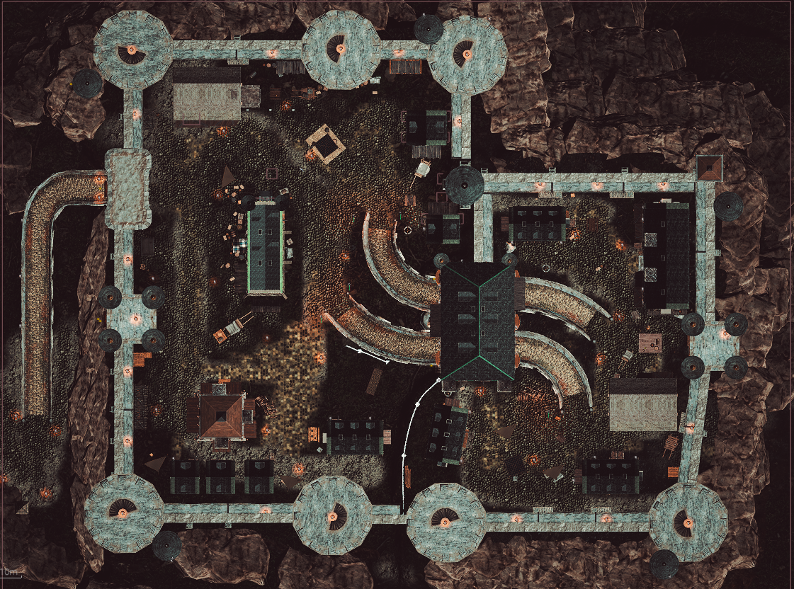

# s1mpleFps

> UE5.8 C++ 多人竞技 FPS — 个人实习求职项目



## 技术栈

`Unreal Engine 5.8` `C++` `Steam OnlineSubsystem` `Enhanced Input` `Behavior Tree` `EQS` `UMG` `Niagara`

## 功能概览

### 🎮 角色系统
- 第一/第三人称切换（相机弹簧臂 + 武器挂点重挂）
- ADS 瞄准、蹲伏、疾跑、嘲讽
- Enhanced Input 全键位绑定 + Player Mappable 运行时改键
- 脚步声 AI 感知噪音源

### 🧗 攀爬系统
- 扇形采样检测可攀爬墙体（多射线 + 夹角/顶面法线/高度三重校验）
- 服务端权威：服务器重新检测（不信任客户端），客户端预测 + Server RPC
- `bIsClimbing` 复制 + 第一/第三人称攀爬蒙太奇 + 起跳→越顶→落地三段插值

### 🔫 武器系统（`UWeaponInventoryComponent` + `UTP_WeaponComponent`）
- 3 武器槽 + 切换（1/2/3/滚轮）
- 半自动 / 连发 / 全自动 三种射击模式
- 后坐力 + 散布模拟 + 枪口震动复位
- 换弹、拾取地上武器
- 枪口火焰特效（Multicast 网络同步）
- 库存用「纯数据槽」`FWeaponSlotInfo` 复制，客户端本地重建组件

### 💣 手雷系统
- 破片手雷（径向伤害 + 穿透 + 摄像机震动）
- 闪光弹（距离衰减 + 视角遮挡计算 + Client RPC 逐个送强度）
- 烟雾弹（粒子特效 + 持续时间）
- 高抛/低抛 + 拉栓烹饪 + 圆环 HUD 进度条

### 🛡️ 伤害与生命系统（`UDamageComponent` + `UHealthComponent`）
- HitZone 部位检测（头部/身体/四肢 伤害倍率）
- 护甲系统（多护甲叠加 + 减伤计算 + 穿透抵消）
- 生命组件：复制血量/死亡状态 + 打药治疗（引导 + 减速）
- DataAsset 数据驱动配置（武器/手雷/护甲/治疗）

### 🤖 PvE AI 系统
- 行为树 + EQS 环境查询
- 4 级警戒状态（Calm → Suspicious → Alert → Combat）
- 视觉 / 听觉 / 受伤 三种感知
- 小队协调（目标共享、角色分配 Assault/Suppressor/Flanker、友军不互伤）
- 掩体寻找、撤退、换弹、调查 AI 行为
- PvE 胜负：击杀目标（默认 30）获胜 / 玩家死亡失败（可关失败=无尽模式）

### 🌐 PvP 网络
- Listen Server + Steam 联机（局域网可替）
- GameInstance Session 管理（Host/Find/Join/Leave）
- 15+ RPC（Server/Client/Multicast）+ 属性复制 + OnRep 回调
- 客户端预测（切枪/拾取/购买） + 服务端验证 + 回滚
- Late Joiner 支持 + 无缝跳图（ServerTravel）

### 🏰 大厅与英雄选择（`ALobbyGameMode` / `UHeroData`）
- 大厅准备/取消准备 + 房主开局 + 开局倒计时
- 选英雄（`UHeroData` 数据资产：模型/头像/动画蓝图）
- 红蓝分队（`ETeam`），队聊按队伍过滤，团队击杀分判胜
- 队伍 + 选中英雄通过 `GameInstance` 跨地图携带（无缝跳图）

### 🚪 门系统（`ADoor`）
- 旋转门 / 平移门两种类型
- 触发器进入才可交互 + 距离校验（防穿墙）
- 服务器计算目标位姿并复制，客户端插值平滑开门

### ⚙️ 设置系统（`USettingsSubsystem`）
- 鼠标灵敏度、主音量/SFX/UI 音量
- `USettingsSaveGame` 存档持久化
- Player Mappable 运行时改键

### 📊 比赛系统
- 热身倒计时 → 正式比赛 → 加时赛 → Sudden Death（可设轮次上限）
- 团队积分判胜（击杀分 + 占点分，同分比击杀）+ 经济系统（击杀/连杀奖励 + 连死补偿）
- 击杀播报 KillFeed（按队伍着色）、计分板
- CS 风格购买菜单（武器/护甲/手雷/医疗）、自动复活 + 队伍出生点

### 🚩 占点模式（Control Point）
- 轮换占点：同时只有 1 个激活点，被占后延时切换下一个（前期长间隔 → 后期短间隔）
- 占领方持续站满 `ScoreTime` 得分，得分 = 基础分 × 时间系数（后期放大封顶）
- 换边需站满 `ControlTime`（争夺/抢点），被抢走得分清零重来
- 圈内多数判定 + 争夺判定 + 激活闪烁材质 + 占点/激活音效
- 团队积分达到 `ScoreLimit` 立即获胜

### 🗺️ 小地图与大地图
- 常驻小地图：世界坐标 → 地图坐标映射（`AMapBoundsActor` 包围盒）
- 自己/队友/敌人图标（按队伍着色）+ 占点点位图标（激活高亮）
- 大地图放大切换（懒加载 `UMinimapWidget`）
- 图标缓存复用 + 定时刷新（不每帧创建/销毁）

### 💬 聊天系统
- 全体聊天（Y）+ 队聊（U），TeamId 过滤，消息自动消失

## 架构

```
Source/s1mpleFps/
├── s1mpleFpsCharacter      — 玩家角色（输入/视角/手雷/门/嘲讽）
├── UWeaponInventoryComponent — 武器库存（切枪/拾取/购买，纯数据复制）
├── UTP_WeaponComponent     — 武器（射击/换弹/ADS/后坐力）
├── UDamageComponent        — 伤害计算（HitZone/护甲/穿透）
├── UHealthComponent        — 生命（复制血量/死亡/打药治疗）
├── GrenadeComponent        — 手雷组件（库存/拉栓/投掷）
├── GrenadeProjectile       — 手雷基类（_Frag/_Flash/_Smoke）
├── ADoor                    — 可交互门（旋转/平移，网络复制）
├── ControlArea             — 占点区域（圈内多数/争夺/得分状态机，网络复制）
├── MapBoundsActor          — 小地图世界范围（X/Y 包围盒）
├── s1mpleFpsGameMode       — 单人 PvE 模式（击杀目标/死亡失败胜负）
├── s1mpleFpsPvPGameMode    — 多人 PvP 模式（击杀/经济/占点轮换/团队积分判胜）
├── ALobbyGameMode          — 大厅模式（准备/选英雄/分队/开局）
├── s1mpleFpsGameState      — 比赛状态（复制：计时/加时/团队积分/占点/KillFeed）
├── s1mpleFpsLobbyGameState — 大厅状态（复制：开局倒计时）
├── s1mpleFpsPlayerState    — 玩家数据（复制：K/D/金钱/队伍/英雄）
├── s1mpleFpsPlayerController — 玩家控制器（HUD/购买/聊天/暂停）
├── s1mpleFpsGameInstance   — Steam Session + 跨地图携带队伍/英雄
├── USettingsSubsystem      — 全局设置（灵敏度/音量/存档）
├── EnemyAIController       — AI 控制器（行为树/感知/小队）
├── EnemyCharacter          — AI 角色
├── HUDWidget               — HUD UI
├── MinimapWidget           — 小地图/大地图（世界坐标映射 + 图标刷新）
└── DataAssets/             — 数据驱动配置
    ├── WeaponData          — 武器参数
    ├── GrenadeData         — 手雷参数
    ├── ArmorData           — 护甲参数
    ├── HealthData          — 治疗参数
    └── HeroData            — 英雄/皮肤参数
```

完整数据流（输入流 / 射击流 / 网络复制 / AI / 比赛状态机 / 大厅选英雄 / 门 / 设置等）见 [`数据流总结.md`](数据流总结.md)。

## 构建 & 运行

### 环境要求
- Unreal Engine 5.8
- Visual Studio 2022（MSVC 14.44 工具链）
- .NET 10.0（UBT 需要，引擎自带）
- Steam（多人联机需要，局域网测试可跳过）

### 构建步骤
```bash
# 1. 克隆仓库
git clone https://github.com/rust830/s1mpleFps.git
cd s1mpleFps

# 2. 从 Epic 商城下载免费资产（项目依赖，未纳入 Git）
#    - Paragon: Murdock（免费角色）
#    - Stylized Log Cabin / Medieval Castle（免费场景）

# 3. 生成 VS 项目文件
右键 s1mpleFps.uproject → Generate Visual Studio project files

# 4. 编译 & 运行
打开 s1mpleFps.sln → Build Solution
```

### 多人测试
```bash
# 主机：编辑器中 Play as Listen Server
# 客户端：编辑器中 Play as Client，或另一台电脑直连 IP
```

## 操作说明

| 按键 | 功能 |
|------|------|
| WASD | 移动 |
| 鼠标 | 视角 |
| 左键 | 开火 |
| 右键 | ADS 瞄准 |
| R | 换弹 |
| 1/2/3 | 切换武器槽 |
| 滚轮 | 上一把/下一把武器 |
| G | 装备/取消手雷 |
| 左键(手雷模式) | 高抛 |
| 右键(手雷模式) | 低抛 |
| Q(手雷模式) | 切换手雷类型 |
| E | 拾取武器 / 开门交互 |
| H | 使用医疗物品 |
| Ctrl | 蹲伏 |
| 空格 | 跳跃 |
| V | 第一/第三人称切换 |
| Tab | 计分板 / 大地图放大 |
| B | 购买菜单（热身阶段） |
| Y / U | 全体聊天 / 队聊 |
| Esc | 暂停 |

## 技术亮点

- **客户端-服务器权威架构**：服务端验证所有关键操作（开火/购买/拾取），客户端乐观预测 + 回滚
- **纯数据槽复制**：武器库存不复制动态组件指针，复制「类 + DataAsset + 弹药」，客户端本地重建，规避运行时 `NewObject` 组件的复制不可靠问题
- **DataAsset 数据驱动**：武器/手雷/护甲/治疗/英雄全部通过 `UPrimaryDataAsset` 配置
- **AI 全栈实现**：从 AIPerception 到 BehaviorTree 到 EQS 的完整 UE5 AI 管线
- **组件化设计**：DamageComponent / HealthComponent / GrenadeComponent / WeaponInventoryComponent 可复用
- **无缝跳图状态携带**：队伍 + 英雄选择跨 `ServerTravel` 携带（`HandleSeamlessTravelPlayer` 钩子恢复）
- **占点轮换调度**：单点激活轮换 + 时间系数缩放得分 + 前后期轮换间隔动态缩短
- **纯函数可测试性**：击杀奖励/伤害/经济计算抽成纯函数，配自动化测试

## 开发日志

1. 基础 FPS 角色 + 武器系统
2. PvE AI 行为树 + EQS + 小队协调
3. PvP 网络复制 + RPC + 客户端预测
4. 比赛系统（热身/加时/Sudden Death）
5. 购买系统 + 聊天 + Session 管理
6. 手雷系统 + HUD 完善
7. 组件化重构（Health/WeaponInventory 拆分）+ UE5.8 迁移
8. 大厅选英雄 + 无缝跳图 + 设置系统 + 门系统
9. 占点模式（轮换占点 + 团队积分判胜）
10. 小地图 / 大地图 + PvE 胜负结算

## License

个人学习项目，仅供参考。
